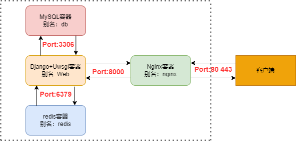

# 测试小助手

基于django-ninja+vue-element开发的平台，目的是为了帮助测试人员提升测试效率，及集成相关辅助测试工具

## Project

| 项目       | 说明                         |
| ---------- | ---------------------------- |
| myproject    | 后端: django + django-ninjia |
| vue-element-admin-new   | 前端：vue2 + element-ui(vue-element-admin模板)      |

## ToDo

功能：

| 功能      | vue-element-admin-new(done) | 
| --------- | -------------- |
| 登录&注册 | ✔️             | 
| 菜单管理  | ✔️              | 
| 配置管理 | ✔️              |
| 权限管理  | ✔️              |      
| 报告管理  | ✔️              |
| 工具管理 | ✔️              |

## windows本地环境开发

* 安装redis/mysql/python/node
```` 
redis-windows版: https://github.com/tporadowski/redis
Python/Mysql/Node:官网自行下载
````

```shell
> redis-server  # 启动redis
```

* 拉取代码
```` 
git clone https://github.com/PatrickHXH/FutureHxh
````

* 修改setting文件
```` 
DATABASES = {
    ...
    'default': {
        ...
        'HOST': '127.0.0.1',  # 测试数据库主机
        # 'HOST': 'db',  # 生产数据库主机
        ...
    }
}

CACHES = {
    "default": {
        ...
        # "LOCATION": "redis://redis:6379",    #生产环境
        "LOCATION": "redis://127.0.0.1:6379", #测试环境
        ...
    }
}
````
* 创建数据库
```` 
create database django_demo default character set utf8mb4 collate utf8mb4_unicode_ci;
````

* 启动后端服务
```` 
cd myproject

python manage.py collectstatic

python manage.py makemigrations

python manage.py migrate

python manage.py runserver
````

* 启动前端服务
```` 
cd vue vue-element-admin-new

npm install

npm run dev
````

## Linux部署

介绍： 基于docker-compose+drone进行持续构建

### 前提：

服务器环境安装：Docker  || Docker-compose

### 安装:
* 修改drone.yml配置
```` 
详见drone.yml配置的注释
````

* 构建Drone镜像
```` 
docker-compose -f drone.yml up -d

Drone服务地址：http:$ip:8888
````

* 修改docker-compose.yml配置
```` 
根据项目自身路径修改配置，详见docker-compose.yml配置注释
````

* 构建web/nginx/redis/db镜像
```` 
>构建镜像 
    - docker-compose build

>启动容器
    - docker-compose up
````

* 容器部署结构

  
### 持续构建
* 修改.drone.yml配置
```` 
详见.drone.yml配置注释
````
* 提升构建速度
```` 
修改/etc/docker/daemon.json文件
{
  "features": {
    "buildkit" : true
  }
}

重启Docker服务：
systemctl daemon-reload
systemctl restart docker

不改动requirements.txt包情况下会自动使用缓存构建
````